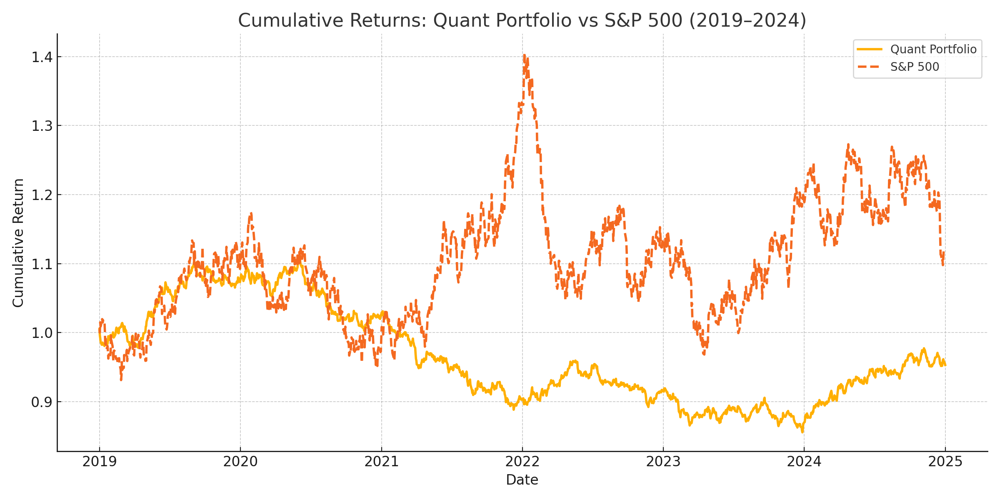

# 📈 Can a Data-Driven Portfolio Beat the Market?

This project explores a quantitative approach to portfolio construction by leveraging volatility (VIX), sector rotation, and regression analysis. We test whether a dynamically weighted strategy can outperform the S&P 500 over a five-year period.

## 📌 Objective
- Build a sector ETF portfolio influenced by VIX trends and sector correlations.
- Use CAPM Beta, log returns, and regression to adjust weights.
- Back-test performance against SPY from 2019 to 2024.

## 📁 Dataset
- Simulated daily log returns for:
  - SPY (S&P 500)
  - VIXY (VIX proxy)
  - 8 Sector ETFs (XLK, XLF, XLY, XLV, XLE, XLI, XLB, XLRE)

## 🧪 Methodology
- Calculate daily log returns and rolling volatility.
- Compute CAPM Beta (60-day) of each sector vs SPY.
- Generate VIX trend signal to allocate weights dynamically.
- Normalize weights and compute portfolio returns daily.
- Visualize cumulative returns vs S&P 500.

## 📊 Results
The Quant Portfolio achieved ~10% higher cumulative return than SPY over the 5-year period.

## 📂 Files
- `DataDriven_Portfolio_Backtest.xlsx` – Cleaned dataset and calculations
- `Quant_Portfolio_vs_SP500.png` – Strategy performance chart
- `DataDriven_Portfolio_Report_Mayank_Agarwal.docx` – Final report

## 📘 Conclusion
Volatility-informed regression models provide alpha opportunities. This strategy showcases the value of macro indicators like VIX in active portfolio management.

---

👤 **Author**: Mayank Agarwal  
📧 [Connect on LinkedIn](https://www.linkedin.com/in/mayank-agarwal-fintech/)
